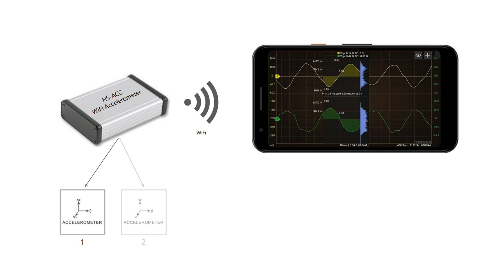
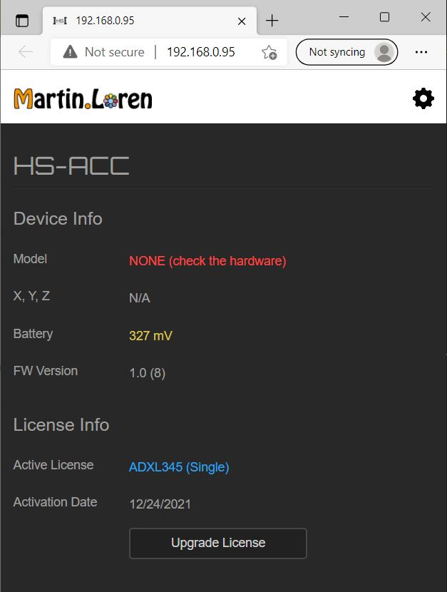
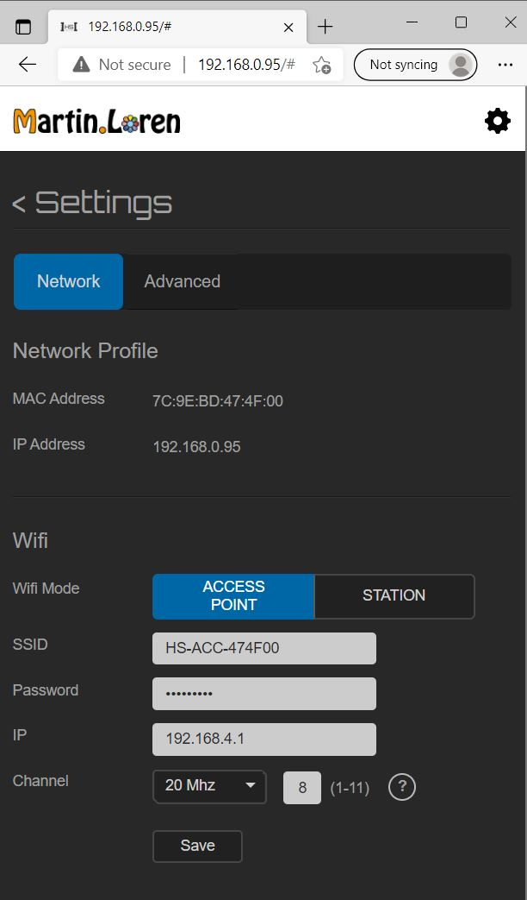

# HS-ACC WiFi Accellerometer
 A DIY instrument based on **ESP32** to record and analyse accelleration data in real-time with [HScope App](http://www.martinloren.com/hscope/).
 
 
 
 - WiFi Communication (STA or AP supported)
 - Supports 1 or 2 accelerometers
 - Sampling rate up to 3200Sa/s, 10bit resolution
 - Full specifications [here](https://www.martinloren.com/hs-acc-wifi-accelerometer/)
 
 ## Available Building Methods
1) Without PCB, just purchase some hardware module and connect by wires. Instruction in <code>No-PCB Build</code> folder.
2) With PCB. You need to build a main controller board (instructions in <code>HS-ACC Main Board</code> folder) and 1 or 2 sensors (instructions in <code>HS-ACC Sensor</code> folder)

 ## How to use - Quick Guide
 When the instrument is powered it creates an Wifi AP with SSID like **ESP-ACC-F62684**. 
 1) Connect to it with the phone (pass: *123456789*);
 2) Enable WiFi connection in HScope Settings;
 3) HScope should connect to it automatically, enjoy!

**Instrument Settings**
After connecting to the instrument WiFi, open the browser at the address 192.168.4.1.

 

<table cellspacing="0" cellpadding="0" style="border: none; border-collapse: collapse;">
<tr>
    <td style="vertical-align: top;"></td>
    <td></td>
</tr>
</table>

# Changelog
### V1.0-8 (Beta)
 - Added check on WiFi password lenght
   
### V1.0-7 (Beta)
 - Fixed base configuration
 - Fixed configuration reset button

### V1.0-6 (Beta)
 - Can use Sigle sensor both on Port 1 and on Port 2
 - Can configure Sensor Axis for each sensor in Dual Model

### V1.0-5 (Beta)
 - Implemented Battery Monitor Circuit
 
### V1.0-4 (Beta)
 - Can configure channels name
 
 ### V1.0-2-DEBUG (Beta)
 - For debugging on USB serial port (115200 baud)
 - Sensors calibration NOT supported
 
 ### V1.0-1 (Beta)
 - Fixed typo in Web Page, fixed styles, added info
 - First Release
 - Sensors calibration NOT supported

 
 
